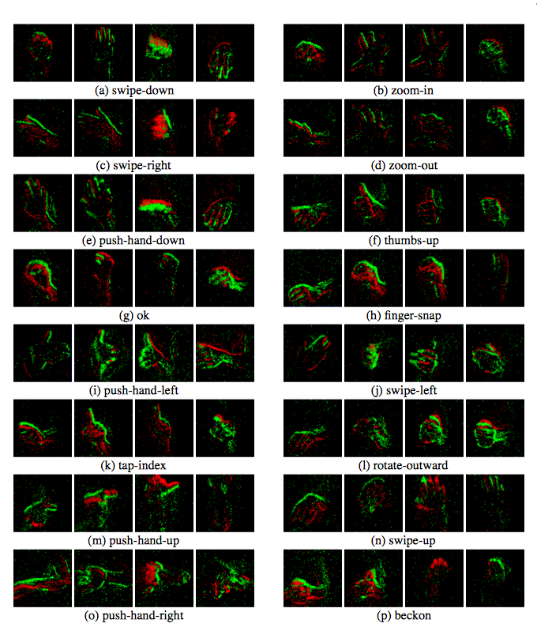

#  Neuro ConGD

Neuro ConGD dataset is a __neuromorphic continuous gesture dataset__, which comprises 2140 instances of a set of 17 gestures recorded in random order. The gestures include beckoning, finger-snap, ok, push-hand(down, left, right, up), rotate-outward, swipe(left, right, up), tap-index, thumbs-up, zoom(in, out) 

 We hope the Neuro ConGD will become useful resource for the __neuromorphic vision research community__.

_Created by Guang Chen, Jieneng Chen, Marten Lienen, Joerg Concadt, Florian Roehrbein and Alois Knoll_

## News!
__Neuromorphic Continuous Gesture Data (prepared & raw & label) are released__.

___We are going to enlarge our dataset. Stay tuned!___

## Introduction
This work is based on our [research paper]().  We release the  __neuromorphic continuous gesture dataset__. 

### Preprocessing
The users can preprocess the data according to their demand:

    python preprocess_events.py [-h] [dirs [dirs ...]] out

## Funding
The building of Neuro ConGD dataset has received funding from the European Union’s Horizon 2020 Research and Innovation Program under Grant Agreement No. 785907 (HBP SGA2).

## License
Our code is released under MIT License. 
